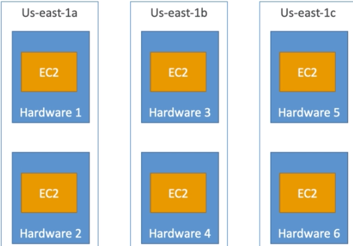

# Tushig`s journey on becoming AWS solutions architect .

I will be conducting 2 hours(min) study sessions until the day of my test, everyday.

##### The session will consist of:
1. Reviewing past sessions
2. Watching AWS lessons from udemy (Thank you Bayarkhuu for the shared lesson)
3. 1 practice exam on the studied subjects

## Day 1 notes:

##### Elastic IP
- You can only have 5 Elastic IP in your account
- Using Elastic IP as a LB is highly discouraged.
##### EC2 Spot instance
- Discount of up to 90% compared to On-demand
- The hourly spot price varies based on offer and capacity
- 2 minutes grace period to choose to stop or terminate your instance.
- **Spot Block** - blocks the spot instance for a time frame(1 to 6 hours) without interruptions
- Spot instances are good for:
        - batch jobs, data analysis, workloads that are resilient to failures
- Spot instances are not good for:
        - critical jobs, databases  
- Disabling Spot Request does not stop the instances. Therefore, in order to cancel the spot instances, one most cancel the spot request first and disable the instances by afterwards.
- **Spot Fleets** = set of Spot instances + (optional) On-Demand Instances
        - It will launch instances from the launch pool(instance type, OS, AZ) until it hits the capacity or the max cost.
        - Strategies to allocate spot instances:
    1. lowestPrice(cost, great for short workload)
    2. diversified(great for availability,long)
    3. capacityOptimized 
##### EC2 Placement Groups
- Cluster - low latency(10Gbps), in a same AZ, on a same hardware. Good for Big Data job that needs to complete fast.
- Spread - Can span across multiple AZs, limited to **7 instances per AZ**, 'Reduced risk' of every instance failing

Good for critical applications where each instance must be iso from each other
 