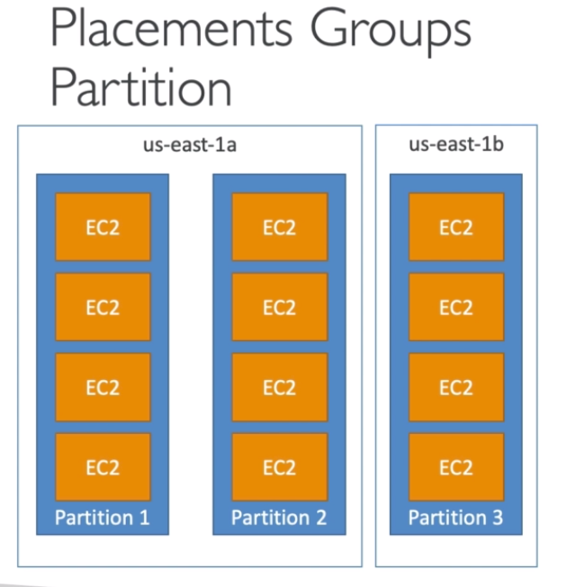
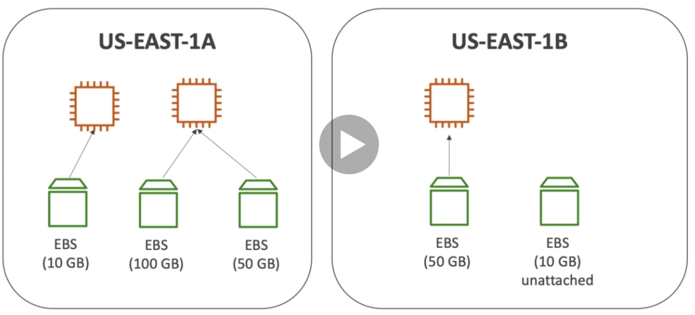
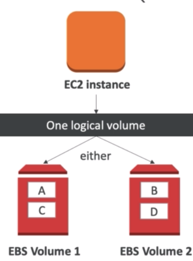
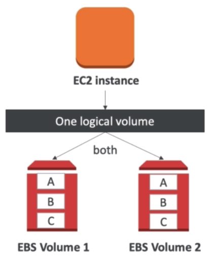
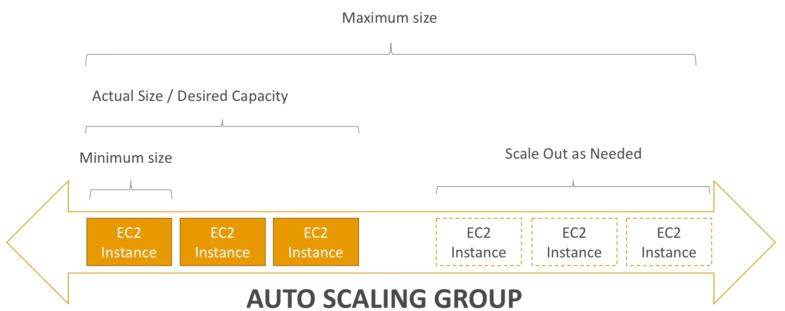
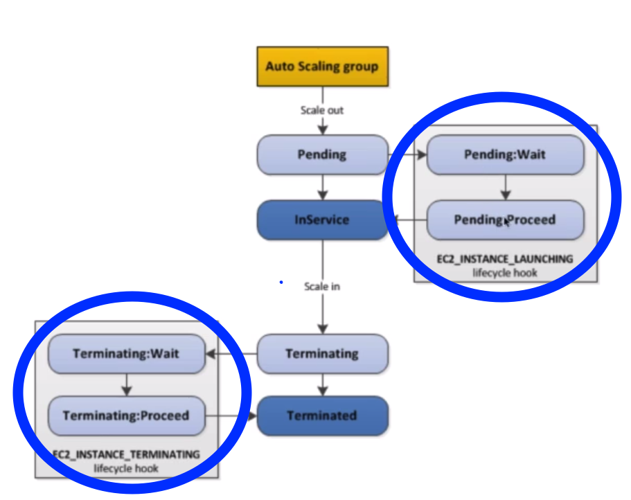
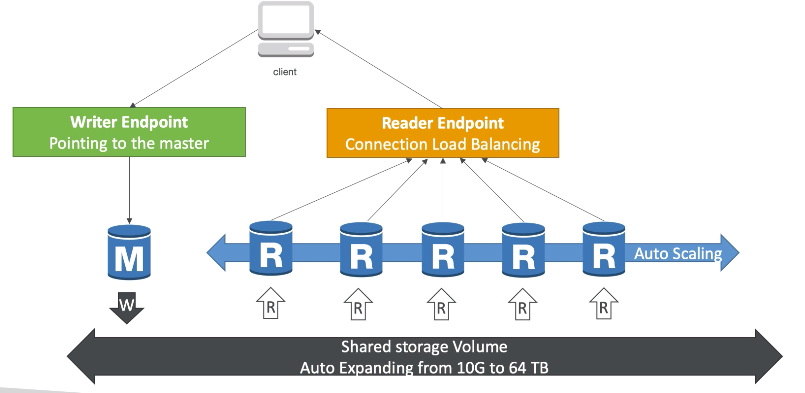

# Tushig`s journey on becoming AWS solutions architect .

I will be conducting 2 hours(min) study sessions until the day of my test, everyday.

##### The session will consist of:
1. Reviewing past sessions
2. Watching AWS lessons from udemy (Thank you @lbayarkhuu for the shared lesson)
3. 1 practice exam on the studied subjects (https://digitalcloud.training/)

## Day 1 notes:

##### Elastic IP
- You can only have 5 Elastic IP in your account
- Using Elastic IP as a LB is highly discouraged.
##### EC2 Spot instance
- Discount of up to 90% compared to On-demand
- The hourly spot price varies based on offer and capacity
- 2 minutes grace period to choose to stop or terminate your instance.
- **Spot Block** - blocks the spot instance for a time frame(1 to 6 hours) without interruptions
- Spot instances are good for:
        - batch jobs, data analysis, workloads that are resilient to failures
- Spot instances are not good for:
        - critical jobs, databases  
- Disabling Spot Request does not stop the instances. Therefore, in order to cancel the spot instances, one most cancel the spot request first and disable the instances by afterwards.
- **Spot Fleets** = set of Spot instances + (optional) On-Demand Instances
        - It will launch instances from the launch pool(instance type, OS, AZ) until it hits the capacity or the max cost.
        - Strategies to allocate spot instances:
    1. lowestPrice(cost, great for short workload)
    2. diversified(great for availability,long)
    3. capacityOptimized 
##### EC2 Placement Groups
- **Cluster** - low latency(10Gbps), in a same AZ, on a same hardware. Good for Big Data job that needs to complete fast.
- **Spread** - Can span across multiple AZs, limited to **7 instances per AZ**, 'Reduced risk' of every instance failing


    Good for critical applications where each instance must be iso from each other
- **Partition** - Up to 7 partitions per AZ, can span accross multilple AZs in the same region, up to 100s of EC2 instances, each partition iso from each other
    - use cases: HDFS, Hbase, Cassandra, and Apache kafka 

## Day 2 notes:
### EC2
##### Elastic Network Interfaces (ENI)
- Logical component in a VPC that represents a virtual network card. (Basically what gives an instance an access to network.)
- ENI HAS:
    - Primary private IPv4, one or more secondary IPv4
    - One Elastic IP (IPv4) per private IPv4
    - One Public IPv4
    - One or more security gorups
    - A MAC address
- Bound to single AZ
- Can reattach to another EC2
##### EC2 Hibernate
- In-memory (RAM) is preserved (boot time is much faster)
Under the hood:
        The RAM is written to a file in the root EBS volume

        Instance RAM size < 150GB
        Available for On-Demand and Reserved instances
        EBS volume must be encrypted and can hold 150 gb obviously
        Instance cannot be hibernated more than 60 days
##### EC2 Nitro
- Underlying platform for next generation EC2 instances
- Allows for better performance:
        -Better networking options (enhanced networking, HPC, IPv6)
        - **Higher Speed EBS (64000 EBS IOPS, MAX 32000 on Non-Nitro)**
- Better underlying security
- Instance types example:
        - A1, Anything after C5
        - all the above with metal in the name: a1.metal, c5 metal etc
##### EC2 vCPU

    vCPU = number of threads on a CPU 
##### EC2 Capacity Reservations

    You can basically reserve EC2 instances on AWS for specific timeframe with specific instance types.
- will get billed as soon as it starts
##### Elastic block store (EBS)
- It is basically cloud USB stick
- It allows your instances to persist data, even after their termination
- Can only be mounted to one instance at a time
- Locked to single AZ (if in us-east-1a, cannot be used in us-east-1b)
- Can be copied across AZs using snapshots.
- Free tier: 30GB of free EBS storage of type General Purpose (SSD) or Magnetic per month
- Have a provisioned capacity(size in GBs and IOPS)
        - will get billed for all the provisioned capcity
        - can increase capcity over time

- By default, when instance is terminated, root EBS will be deleted. It can be changed
- By default, when instance is terminated, EBS volumes other than root will not be deleted
##### EBS Volume Types
- 6 types:
    - gp2/gp3(SSD): General purpose SSD volume (1gb - 16tb)
        - **gp2**: 
            -Small gp2 volumes can burst IOPS to 3000
            -size of the volume and IOPS are linked, MAX IOPS is 16000
            - 3 IOPS per GB, means at 5334 GB we are at max IOPS
        - **gp3**: 
            - can burst from 3000 to 16000 IOPS and throughput from 125 MB/s to 1000 MB/s  
    - io1/io2(ssd):  Provision IOPS SSD volume (4 GB - 16 TB) for low-latency high-throughput workloads
        - Critical business applications with sustained IOPS
        - Applications that needs more than 16000 IOPS
        - Great for DB workloads
        - Max PIOPS: 64000 for Nitro EC2 & 32000 for others
        - Can increase PIOPS independently from storage size
        - io2 have more durability and more per GB at the same price as io1
        - Can use io2 Block express (4gb - 64tb):
            - sub millisecond latency
            - Max PIOPS: 256000 with an IOPS:GB ratio of 1000:1
        - Supports EBS multi-attach
    - st1 (HDD): Throughput optimized HDD volume for freq accessed, throughput intensive workloads (125mb to 16tb)
        - Big data, data warehouse, log processing
        - Max throughput: 500MB/s - max IOPS 500
    - sc1 (HDD): Cold HDD volume for less freq accessed workloads (125mb to 16tb)
        - Data that is very rarely accessed (e.g:your mother`s phone number)
        - Lowest cost
        - Max throughput: 250MB/s - max IOPS 250
- ONLY gp2/gp3 or io1/io2 can be used as root volume

##### EBS Multi Attach - io1/io2 family
- Attach the same EBS to a multiple EC2 instance in the same AZ
- Each instance has full read & write permissions to the volume
- Use case:
    - Achieve higher availability in clustered Linux applications
    - Applications must manage concurrent write operations
- Must use file system that is 'cluster-aware'

##### EBS Snapshots
- Make a backup (snapshot) of EBS at any point in time
- Recommended to detach from instance to do snapshot
- Can copy snapshots across AZs or even Regions

##### EBS Encryption
- When encrypted EBS volume is created everything will be encrypted:
    - data at rest
    - data in flight between instances
    - all snapshots
    - all volumes that are created from those snapshots
- Encryption and decryption is handled behind the scenes
- Encryption has a minimal impact on latency
- Encryption from KMS (AES-256)
###### HOW TO ENCRYPT UNENCRYPTED VOLUME:
- create EBS snapshot
- encrypt the snapshot (using copy -> ? might have to look into it)
- create new EBS volume from the snapshot
- attach the volume to the original instance

##### Amazon Machine Images (AMI)
- Customization for EC2 instances
    - Add your own software, config, OS, monitoring etc
    - Faster boot since all your software is pre packaged
- Built for specific regions (can be copied across regions)
- Can launch instance from:
    - Public AMI (AWS provided)
    - Own AMI
    - AWS marketplace AMI (kinda like github i guess)
##### EC2 Instance Store
        - Basically a physical hard drive attached to the physical server
- Better I/O performance since it is attached physically
- If the attached EC2 instance is terminated the storage will be lost
- Good for: buffer / cache/ scratch data / temp content
## Day 3 notes:
##### EBS RAID Options
RAID is possible as long as your OS supports it.
- RAID 0: to increase performance/ Risk more
    ```
    It basically adds 2 EBS volumes (size, IOPS and everything) to increase performance with a increased risk of failure, because if one of the disk fails everything fails.
    ```

- RAID 1: to increase fault tolerance
    ```
    It basically mirrors one EBS to another EBS by sending the data to both of them at the same time just like your ex-gf. 
    ```

###### DO NOT NEED TO KNOW THESE
- RAID 5
- RAID 6
- RAID 10

#### EFS - Elastic File System
```
Managed NFS(Network file system) that can be mounted on many EC2 across different AZ
```
- **Available across Multilple AZs**
- Highliy available, scalable, expensive (3xgp2), pay per use
- Uses NFSv4.1 protocol
- **Only compatible with Linux based AMI**
- Uses Security group to control access to EFS
- Encryption at rest using KMS
```
Generally, EFS is very high performant and the scaling is done automatically
```
- Performance mode (set when creating the EFS)
    - General purpose(default): webserver, cms etc
    - Max I/O (higher latency, throughput) : big data, media processing etc
- Throughput mode
    - Bursting (default): 1TB = 50MB/s + burst of up to 100MB/s
    - Provisioned: set your throughput regardless of size, ex: 1GB for 1TB storage
- Storage tiers
    - Standard: for frequently accessed files
    - Infrequent access(EFS-IA): cost to retrieve files, lower price to store

### LB - Load Balancer
#### Why use Load Balancer?
- Spread load across multiple instances
- Expose a single point of access
- Handle failures
- Regular health check
- SSL termination (HTTPS) for your websites
- enforce stickiness with cookies
- High availability across zones
- Separate private and public traffic
- AWS takes care of upgrades, maintenance, high availability
#### 3 Types of load balancer on AWS:
- Classic LB (v1-old gen) - 2009
    - Layer 4 - TCP
    - Layer 7 - HTTP, HTTPS
    - Health checks are tcp or http based
    - fixed hostname: XXX.region.elb.amazonaws.com
    - Support only one SSL certificate
- Application LB (v2-new gen) - 2016
    - Layer 7 - HTTP, HTTPS, WebSocket
    - Can load balance to multiple applications (e.g. containers)
    - Can redirect from http to https
    - Route based on path in URL
    - Route base on hostname in URL(some.example.com & other.example.com)
    - Route based on Query string, Headers
    - Supports multiple listeners with multiple SSL certificates
    ```
    Good for microservices or other container based applications because it has port mapping feature to redirect to a dynamic port in ECS
    ```
    - Target groups:
        - EC2 instances
        - ECS tasks
        - Lambda functions
        - IP addressses

        **ALB can coute to multiple target groups**
    - fixed hostname: XXX.region.elb.amazonaws.com
    - x-forwarded-proto = header for forwarded client ip
- Network LB (v2-new gen) - 2017
    - Layer 4 - TCP, TLS(Secure TCP) & UDP
    - Handle millions of request per secons, Less latency
    - One static IP per AZ
    - Not included in the AWS free tier
    - Supports multiple listeners with multiple SSL certificates     
#### Good to know
- Can setup both private and public LB
- LBs can scale but not instantaneously
- ELB access logs will log all access requests
- Cloudwatch Metris will give you aggregate statistics
- LB Errors 503 means at capacity or no registered targets
- Can use cookie to implement stickiniess so that the same client is always redirected to the same instance (only CLB or ALB)
#### Cross-zone Load Balancing
``
If this option is enabled, all of the incoming traffic will be distributed evenly across the instances regardless of which AZs they are in.
``
- ALB
    - always on can`t be disabled
    - no charges for inter AZ data
- NLB
    - disabled by default
    - you pay charges for inter AZ data
- CLB
    - if created through console => enabled by default
    - if created through CLI/API => disabled by default
    - No charges for inter AZ data
## Day 4 notes:
##### SSL certificates
- ```The load balancer uses X.509 certificate```
- ```Can manage certificates using ACM (AWS certificate manager)```
- Can create/upload your own certificates
- https listener:
    - must specify default certificate
    - can add an optional certs
    - **Clients can use SNI (Server name idication) to specift the hostname they reach**
        - SNI solves the problem of loading multiple SSL certificates onto one webserver
        - only supports ALB, NLB and CloudFront

 ##### Connection Draining
 ``` "Connection Draining" for CLB or "Deregistration delay" for ALB & NLB```
- Time to complete "in-flight" requests while the instance is unhealthy or deregistering.```
- Between 1 to 3600 seconds, default is 300
- Can be desabled
#### Auto Scaling Group
**Attributes:**
- A launch config
    - AMI + instance type
    - EC2 User Data
    - EBS volumes
    - Security groups
    - SSH key pair
- Min/ Max size/ Init capacity
- network + subnets information
- LB information
- Scaling policies-> what will trigger scale in and out


## Day 5 notes:
##### Scaling policies:
- Target Tracking Scaling
    -  Most simple to set up
    - E.g: I want the average ASG CPU to stay at around 40%
- Simple/ Step Scaling
    - if cpu > 70%  + 2 instance elif cpu < 30%  - 1 instance
- Scheduled Actions
    - I want +2 instance on Mondays at 2pm

##### Scaling Cooldowns:
- CD between scaling actions. (kind of obvious if u think about it)
- In addition to default CD, can create specific cd for **simple scaling policy**
- `specific cds do not add up, instead they override the default CD`
- Can/Should override the CD for scale-in(terminate instances) policies
##### Good to know:
- ASG Default termination policy:
1. Find the AZ which has the most number of instances
2. If there are multiple instances in the AZ to choose from, delete the one with oldest config.
`ASG tries to balance the number of instances across AZ by default`
- Lifecycle hooks:
`Basically an ability to send the instance to a wait state to perform actions before it goes in service or terminated`

- Launch Template vs Launch Config
`Both can choose the specific params such as ID of the AMI, type, key, user data etc but`**always go with the launch template** 
    
    - Launch template
    1. newer
    2. AWS recommended
    3. Can have multiple version
    4. Can create params for re-use and inheritance
    5. Can provision using both On-demand and spot instances
    6. Can use t2 unlimited burst feature
    - Launch config
    1. old - legacy
    2. Must be re-created every time you change something

## Day 6 notes:
#### AWS RDS:
- Postgres
- MySQL
- MariaDB
- Oracle
- Microsoft SQL Server
- Aurora
###### Why RDS over deploying DB on EC2?
- Automated provisioning, OS patching
- Continuous backups and restore to specific timestamp
- Monitoring dashboard
- Read replicas for improved read peformance
- Multi AZ setup for Disaster Recoivery
- Maintenance windows for upgrades
- Scaling capability (vertical and horizontal)
- Storage backed by EBS (gp2 or io1)
- **BUT you can`t ssh into your instances** 

`RDS - Backups`
Automated Backups:
- Daily backup (during maintenance window)
- Transaction logs are backed up by RDS every 5 minutes
- Ability to restore to any point in time
- 7 days retention (can be increased to 35)
- DB Snapshots are manually triggered by the user

`RDS - Storage Auto Scaling`
Have to set Maximum storage threshold.
Automatically modifiy storage if:
- Free storage < 10% allocated storage
- Low storage lasts at least 5 minutes
- 6 hours have passed since last modification

`RDS - Read Replicas`
- up to 5 read replicas
- has 3 scope options 
    - Within AZ (free)
    - Cross AZ (free)
    - Cross Regions ($$$)
- Replication is async
- Replicas can be promoted to their own DB (oh geez im a real DB now)
- Applications must update the connection string to leverage read replicas. (I actually don`t understand this sentence)

`RDS - Multi AZ(Disaster Recovery)`
- Sync Replication
- One DNS name
- Increase availability
- Failover in case of loss of AZZ, los of network, instance or storage failure
- Not used for scaling
##### Good to know:
- The READ replicas can be setup as the standy DB for multi AZ
- From single AZ to Multi Az operation has zero downtime

`RDS Security - Encryption`
- At rest encryption
    - Possibility to encrypt the master & read replicas with AWS KMS
    - Encryption is defined at launch time
    - **If the master is not encrypted, the read replicas cannot be encryped**
    - Transparent Data Encryption (TDE) available for Oracle and SQL server
- In-flight encryption
    - Obviously SSL certficate to encrypt data to RDS in flight
    - Provide SSL options wtih trust certificate when connecting to db
    - To **enforce** SSL:
        - PostgreSQL: rds.force_ssl =1 in the AWS RDS console
        - MySQl: Within the DB:
        ```GRANT USAGE ON *.* 'mysqluser'@%' REQUIRE SSL;```

`RDS Security - Network * IAM`
- Network Security
    - RDS databases are usually deployed within a private subnet, not in a public one
    - RDS security works by leveraging security groups
- Access Management
    - IAM policies help control who can manage AWS RDS (who can delete, create read replica etc)
    - Uses normal username & password to login to the database. 
    - However, IAM-based authentication can be used to login into RDS with MySQL & PostgreSQL
 #### AWS Aurora
 Faster, better MySQL
 - failover is basically instant
 - storage grows automatically
 - can have 15 replicas
 - replication is much faster
 - cloud native
 - cost is 20% more
 
 - Has writer DNS
 - Has reader DNS 
 - Can create custom endpoint for the read replicas. However, when custom endpoint is created, the default endpoint gets removed. 